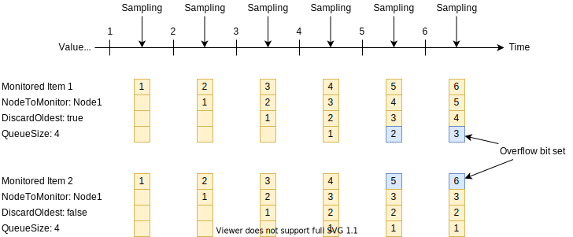
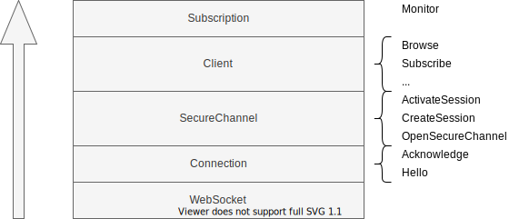

# opcua

TypeScript / JavaScript OPC UA client for the browser.

[](https://github.com/hbm/opcua/actions?query=workflow%3Aci)
[](https://seriesci.com/HBM/opcua/series/master/coverage)

... work in progress ...

## Features

- OPC UA binary data encoding ([Part 6: Mappings - 5.2.1](https://reference.opcfoundation.org/v104/Core/docs/Part6/5.2.1/))
- WebSockets transport protocol ([Part 6: Mappings - 7.5.1](https://reference.opcfoundation.org/v104/Core/docs/Part6/7.5.1/))

## Usage

```bash
npm i opcua
```

```ts
import Client from 'opcua'

const client = new Client()

// wait for an active session
client.addEventListener('session:activate', async event => {

  // browse the root folder
  const req = new BrowseRequest({
    NodesToBrowse: [
      new BrowseDescription({
        NodeId: NewTwoByteNodeId(IdRootFolder)
      })
    ]
  })

  // all requests use async / await
  const res = await client.browse(req)
  console.log(res)
})
```

## Subscriptions

... work in progress ... it's pretty complex so we need some diagrams

### Queue overflow handling

https://reference.opcfoundation.org/v104/Core/docs/Part4/5.12.1/#5.12.1.5



## Development

The source code is written in TypeScript. We use the TypeScript compiler to create the JavaScript files for the browser.

Some source code files are autogenerated.

- `src/ua/generated.ts` by `cmd/service/main.go`
- `src/id/id.ts` by `cmd/id/main.go`
- `src/ua/StatusCode.ts` by `cmd/status/main.go`

Do not edit them by hand. You need [Go](https://golang.org/) on your machine to execute those generators. The schema definition files are located at `./schema`.

We rely on [reflection and decorators](https://www.typescriptlang.org/docs/handbook/decorators.html) to get types (e.g. `uint32`, `CreateSessionRequest` or arrays of certain types `string[]`) during runtime. In JavaScript a number is always [double-precision 64-bit](https://developer.mozilla.org/en-US/docs/Web/JavaScript/Reference/Global_Objects/Number). OPC UA has much more number types like `int8`, `uint8`, `int16`, `uint16` and so on. In order to get the binary encoding / decoding right we must know exactly how many bits represent a number.

The client architecture consists of multiple layers. They closely follow the official OPC UA specification. Read the following diagram from bottom to top. On the right side you find the responsibilities for each layer.



The OPC UA handshake is quite complex and several steps are necessary to get an active session. Those steps are

1. Hello / Acknowledge
1. Open Secure Channel
1. Create Session
1. Activate Session

The following diagram shows this sequence and highlights response parameters that the client has to store internally (e.g. channel id, token id, authentication token, sequence number, request id).


You need an OPC UA server implementation that supports WebSockets to test the client. Two options exist:

1. Use [open62541](https://github.com/open62541/open62541) with WebSockets enabled
1. Use [websockify](https://github.com/novnc/websockify) for servers that do not support WebSockets (that only support TCP connections)
